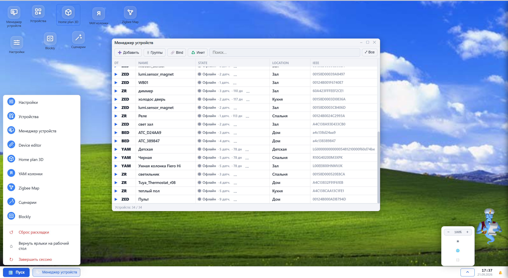
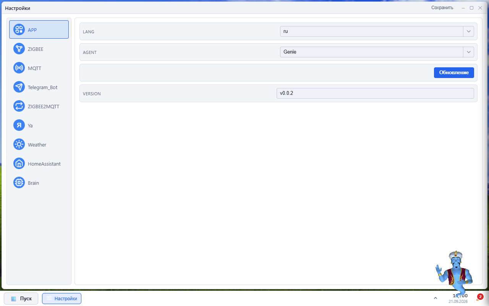
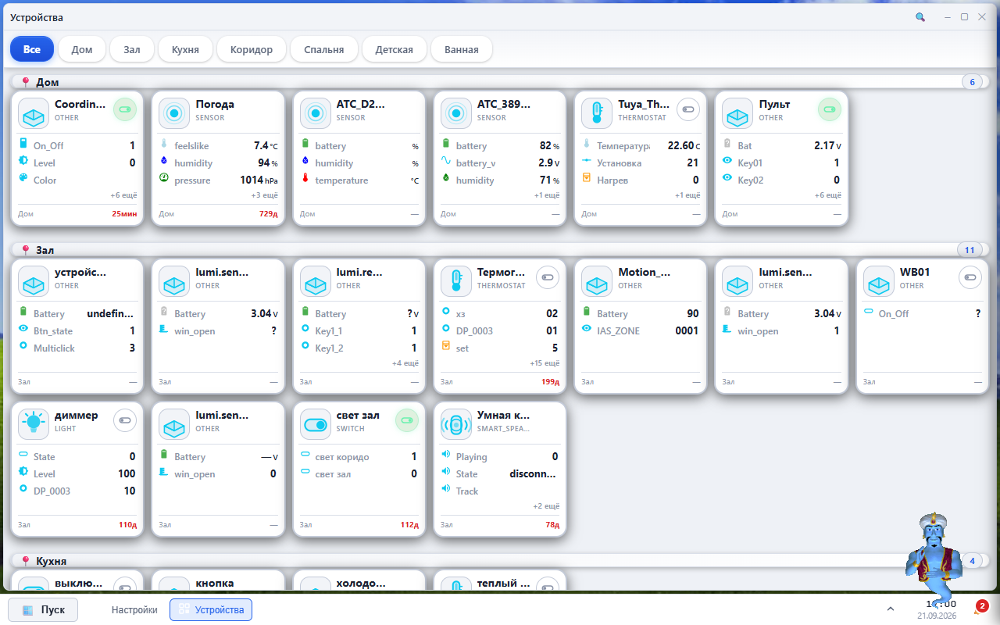
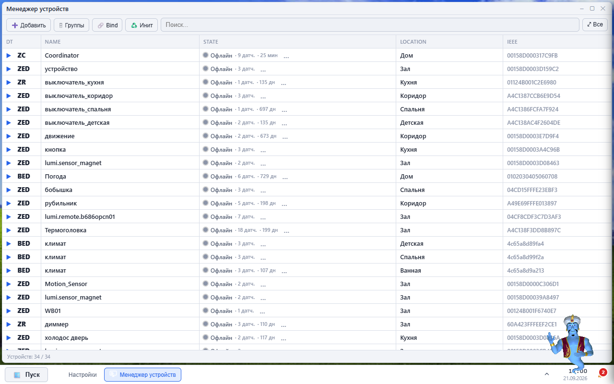
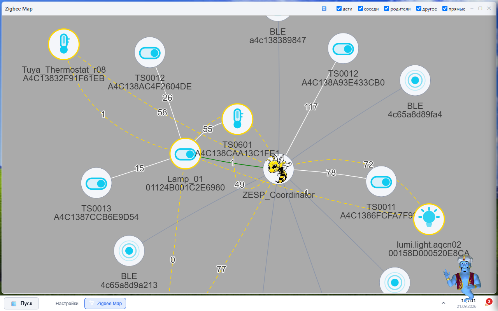
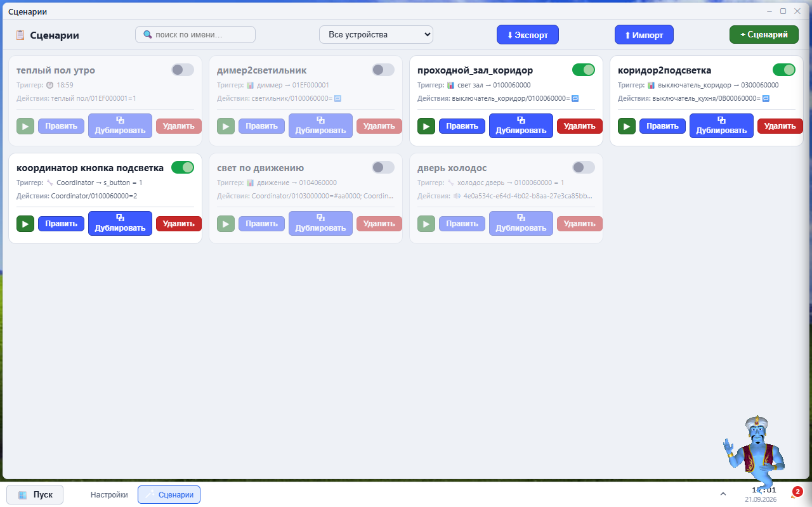
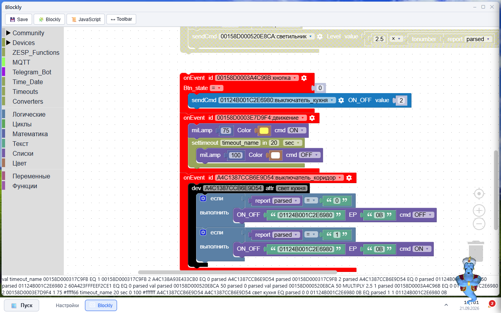
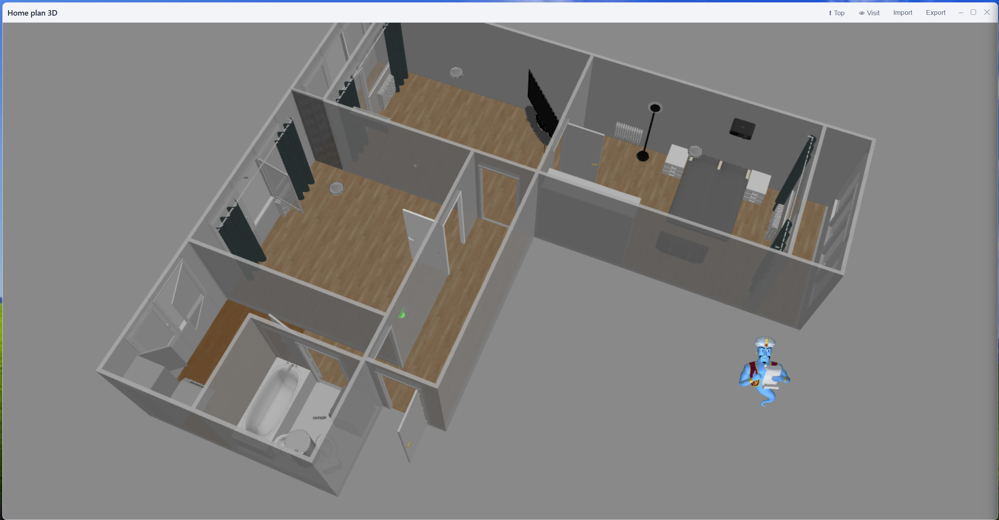
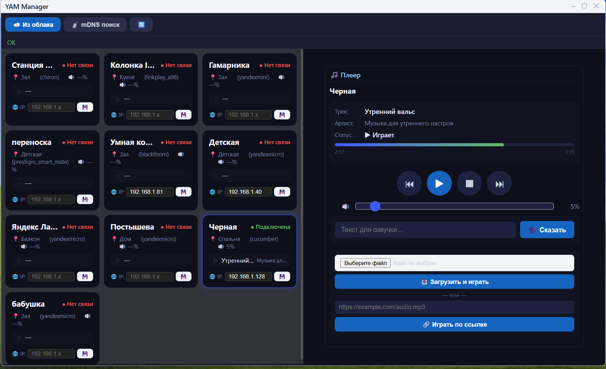
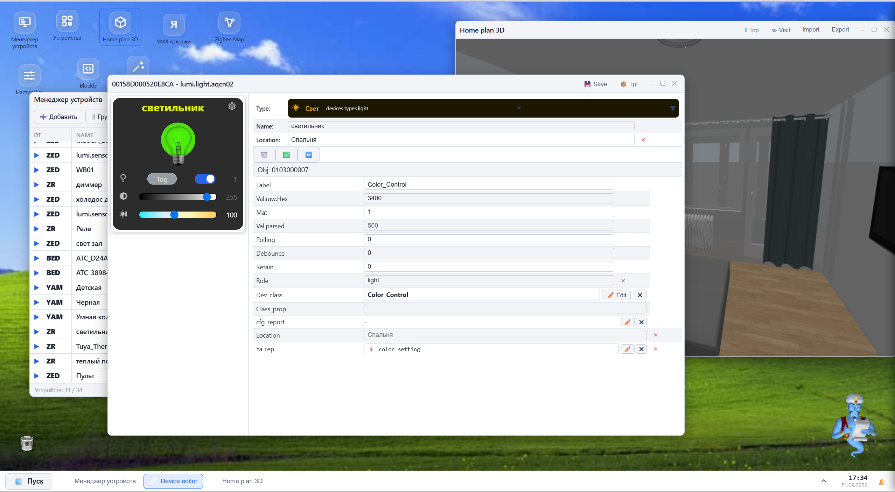

<p align="center">
  
</p>

<h1 align="center">ZESP</h1>

<p align="center">
Сервер умного дома с веб-интерфейсом. Ставится на роутер с OpenWrt, Raspberry Pi, мини-ПК, обычный Windows-компьютер или Mac. Умеет: Zigbee-устройства, карту сети, автоматизацию (Blockly), сцены, 3D-план дома, MQTT + Home Assistant, Яндекс-колонки.
</p>

## Что понадобится

Железка: роутер с OpenWrt, Raspberry Pi, мини-ПК, Windows-ПК или Mac.

Zigbee-адаптер (одна из «флешек»): ZiGate, ZBoss, TI Z-Stack (CC2530/CC2531/CC2652), EmberZNet/EZSP (EFR32, SkyConnect, Sonoff ZBDongle-E), Telink.

Можно и без адаптера — тогда будут только колонки, сцены и автоматизация, без Zigbee-устройств.

Остальное по желанию: MQTT-брокер, аккаунт Яндекса (для колонок), Telegram-бот.

## Какой файл скачивать

Со страницы [Releases](https://github.com/DJONvl/ZESP_desktop/releases):

| У тебя | Файл |
|---|---|
| Обычный Windows-компьютер (64-bit) | `zesp_windows_x64.zip` |
| Старый Windows (32-bit) | `zesp_windows_x86.zip` |
| Linux-ПК (64-bit) | `zesp_linux_amd64.tar.gz` |
| Raspberry Pi 4 или 5 | `zesp_linux_arm64.tar.gz` |
| Raspberry Pi 2 или 3 | `zesp_linux_armv7l.tar.gz` |
| Роутер OpenWrt | ничего не качай — ставь скриптом ниже, он сам выберет |
| Mac (Intel) | `zesp_darwin_amd64.tar.gz` |
| Mac (M1/M2/M3) | `zesp_darwin_arm64.tar.gz` |

Если не знаешь, 32-bit у тебя или 64-bit — на Windows посмотри «Параметры → Система → О системе». На Raspberry Pi модель написана на корпусе.

## Установка

### Linux / OpenWrt — выбери свою строку

Обычная система (есть wget или curl):

```sh
wget https://raw.githubusercontent.com/DJONvl/ZESP_desktop/master/install/install.sh && sh install.sh
```

Голый OpenWrt (wget без https) — любой из двух:

```sh
uclient-fetch -O install.sh https://raw.githubusercontent.com/DJONvl/ZESP_desktop/master/install/install.sh && sh install.sh
```

```sh
printf 'GET /DJONvl/ZESP_desktop/master/install/install.sh HTTP/1.0\r\nHost: raw.githubusercontent.com\r\nConnection: close\r\n\r\n' | openssl s_client -quiet -connect raw.githubusercontent.com:443 -servername raw.githubusercontent.com 2>/dev/null | sed '1,/^\r$/d' > install.sh
grep -q '^REPO=' install.sh && sh install.sh || echo DOWNLOAD FAILED
```

Второй способ — через openssl, если он есть, а качалок нет. Вставлять строго одной строкой: разорванная вставка — главная причина молчаливых fails. grep не даст запустить пустой файл.

Совсем нет качалок — закинь два файла с ПК в `/tmp` железки (по scp/WinSCP) и запусти офлайн:

```sh
LOCAL_TGZ=/tmp/zesp.tgz sh install.sh
```

Нужны: сам `install.sh` (папка [`install/`](install/) этого репо) + архив под твою архитектуру из таблицы выше.

Если opkg живой, а качалок нет — сначала `opkg update && opkg install curl`, дальше способ 1.

Установка идёт в `/opt/zesp` (бинарь `zesp` + фронт рядом). Под рутом добавится systemd-юнит. Из-под юзера — в `~/zesp`. Подробности — [install/install.sh](install/install.sh).

### Windows

Скачай [`install/install.bat`](install/install.bat) и запусти. Всё распакуется в `C:\ZESP`, на рабочем столе появится ярлык ZESP. Запускай только через ярлык (или `zesp_start.bat`) — он сам перезапускает сервер и применяет обновления.

### Вручную (если хочется)

1. Скачай архив под свою платформу.
2. Распакуй: внутри бинарь + папка `desktop/` (+ `zesp_start.bat` на Windows).
3. Запусти: на Windows — через `zesp_start.bat`, на Linux — `./zesp`.
4. Открой `http://<ip-железки>:8081`. Порты: `8081` — веб, `8181` — WebSocket.

При первом старте недостающие конфиги создаются сами из шаблонов (`.tpl`).

## Первый запуск (5 минут)

1. Открой в браузере `http://<ip-железки>:8081`.
2. Настройки → **ZIGBEE**: выбери свой адаптер (Adapter), укажи порт:
   - Windows — COMx (например COM3),
   - Linux — /dev/tty... (например /dev/ttyUSB0),
   - сетевой — host:ip:port.

   Остальное (скорость, канал, PanID) оставь по умолчанию. Сохрани. Смена адаптера требует перезапуска сервера.
3. В списке устройств найди **Coordinator** → включи **PermitJoin** (это режим «разрешаю новым устройствам подключиться»).
4. Переведи Zigbee-устройство в режим спаривания (обычно долгое нажатие кнопки) — оно появится в списке. Дай ему имя и комнату.
5. Дальше по вкусу: сцены, Blockly-автоматизация, MQTT/Home Assistant, Яндекс-колонки — всё в настройках.

## Интерфейс (живые скриншоты)

Веб-десктоп на `http://<ip-железки>:8081`: ярлыки сверху, окна, таскбар «Пуск» снизу, светлая/тёмная тема. Кадры ниже — с рабочей программы (реальные устройства, светлая тема).



### Настройки
Вкладки APP, ZIGBEE, MQTT, Telegram_Bot, ZIGBEE2MQTT, Ya, Weather, HomeAssistant, Brain. Здесь же кнопка «Обновление», выбор языка и агента-ассистента.



### Устройства — плитки по комнатам
Комнаты-вкладки (Дом, Зал, Кухня...), в каждой — плитки: Coordinator, датчики погоды/влажности, термоголовка Tuya, пульт, выключатели. Видно заряд, температуру, время последней активности («25мин», «729д»).



### Менеджер устройств — таблица
Служебный список всей сети: тип (ZC — координатор, ZED — конечное, ZR — роутер, BED — BLE), имя, состояние/датчики, комната (Location), IEEE-адрес. Кнопки: Добавить, Группы, Bind, Инит, поиск.



### Zigbee Map — карта сети
Граф на vis.js: в центре ZESP_Coordinator, вокруг лампы/выключатели TS0011/TS0012/TS0013, термостаты, BLE-метки. На рёбрах — LQI (качество связи). Фильтры сверху: дети, соседи, родители, другое, прямые.



### Сценарии — «триггер → действие»
Карточки типа «проходной_зал_коридор», «коридор2подсветка», «тёплый пол утро», «свет по движению»: триггер (время/событие устройства) + действия. Кнопки: выполнить сейчас, Править, Дублировать, Удалить, Экспорт/Импорт.



### Blockly — автоматизация блоками
Событийные блоки `onEvent id <IEEE:имя>`: кнопка → `sendCmd` на выключатель кухни, движение → подсветка координатора (miLamp) с таймаутом, выключатель коридора → условие по `report parsed` и команды ON/OFF. Слева категории Community/Devices/ZESP_Functions/MQTT/Telegram_Bot, переключение Blockly/JavaScript.



### Home plan 3D — план дома
3D-редактор (Sweet Home 3D): комнаты, сантехника, привязка устройств к объектам («погода»). Режимы Top/Visit, Import/Export плана.



### YAM колонки — Яндекс-колонки
Карточки колонок из облака (Зал, Детская, Спальня) с IP и статусом связи, кнопки «Из облака» и «mDNS поиск». Справа плеер: play/pause, громкость, TTS-поле «Текст для озвучки…» + «Сказать», загрузка файла и «Играть по ссылке».



### Device editor — шаблоны устройств
Редактор профиля устройства: Type, Name, Location, кнопка «+ object», сохранение в `Devices/<IEEE>` (Save) и в общий шаблон (Tpl). Пустой — открывается для нового/неизвестного устройства.



## Обновления

Сервер сам проверяет [Releases](https://github.com/DJONvl/ZESP_desktop/releases). В настройках (APP) есть кнопка «Обновление» — она скачает архив под твою платформу, заменит файл программы (старый останется как `.old`) и фронт, потом попросит перезапуск. Настройки и устройства при этом не трогаются.

## Что где лежит (для любопытных)

```text
desktop_lite/apps/   виджеты: devicemanager, devices, zigbeemap, blockly,
                     scenes, sh3d, templateedit, settings, yammanager
desktop_lite/js/     движок окон, сокеты, локализация
static/              библиотеки (blockly, sweet-home-3d, виджеты, иконки)
Devtemplates/        общие шаблоны устройств
img/                 фото устройств
*.tpl                шаблоны: jsconfig.tpl, devicesjs.tpl, workspace.tpl
install/             скрипты установки (в релизные архивы НЕ пакуются)
```

## Личные файлы (в git не попадают)

`jsconfig.txt` (настройки + токены), `devicesjs.txt`, `Devices/`, `scenes.json`, `groups.json`, `location.json`, `workspace.xml` — живут только на твоей машине. Никому не выкладывай: там токены.

## Если что-то пошло не так

* Не открывается страница — проверь, что сервер запущен, и что порт 8081 не занят.
* Zigbee-устройство не находится — включён ли PermitJoin, тот ли порт адаптера, в режиме ли спаривания само устройство.
* После обновления ничего не работает — перезапусти сервер и смотри лог; крайний случай — верни `.old` обратно вместо бинаря.
